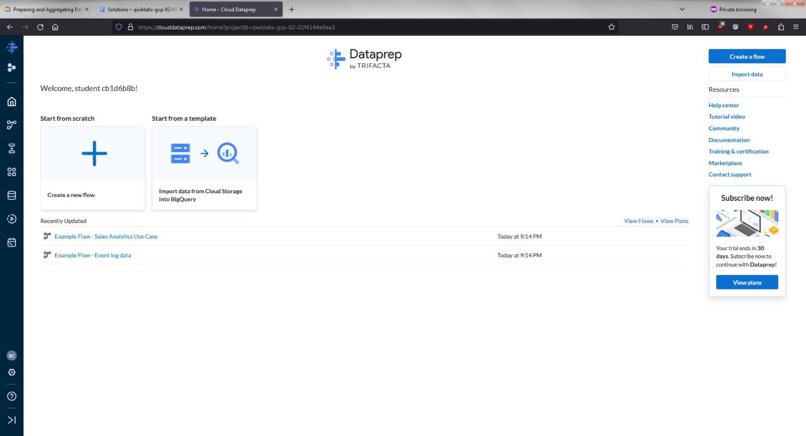
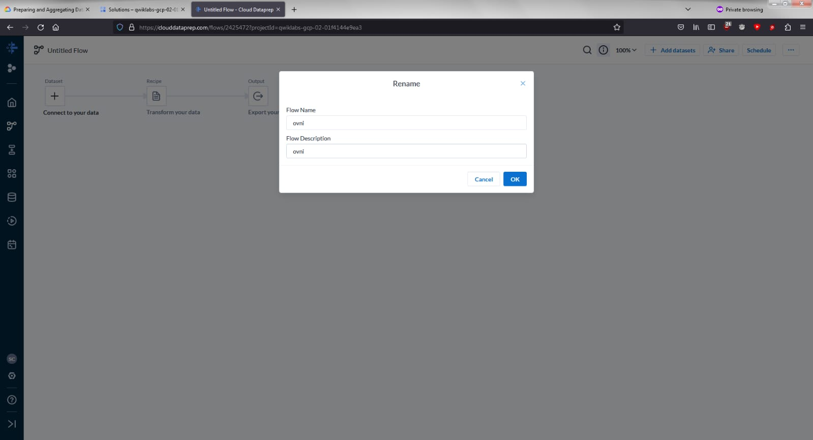
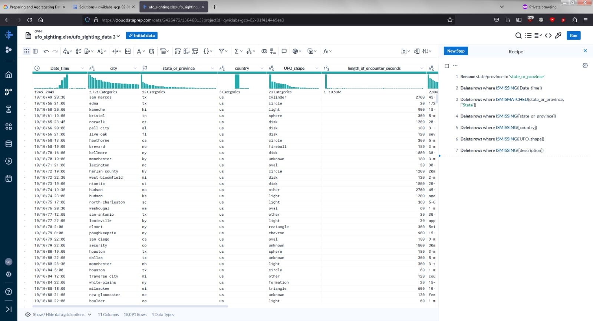
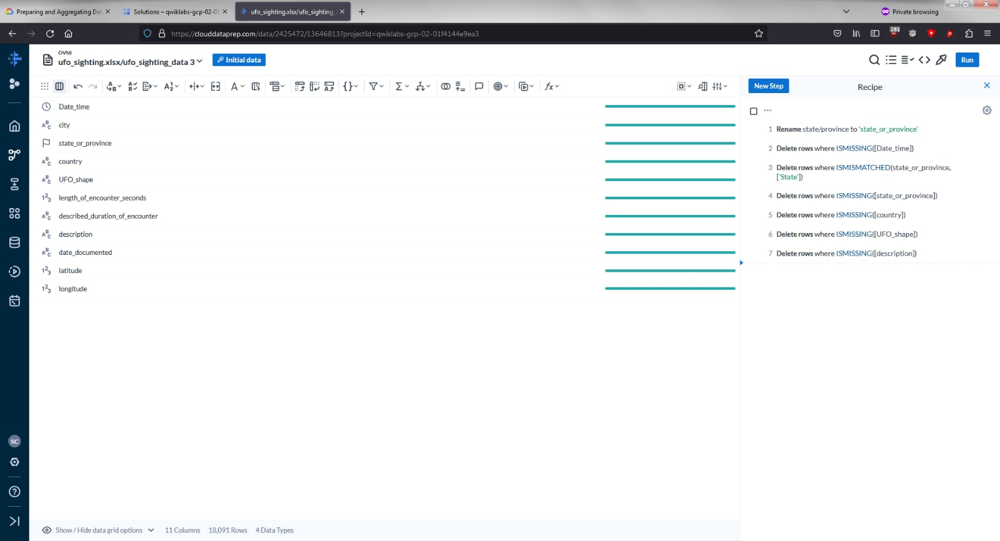
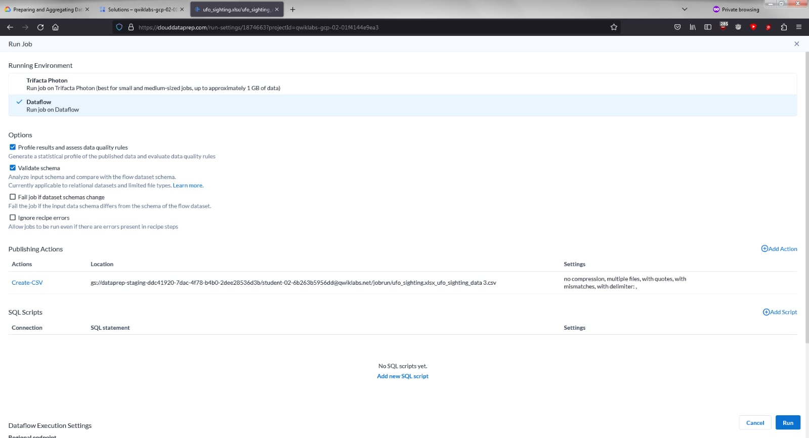
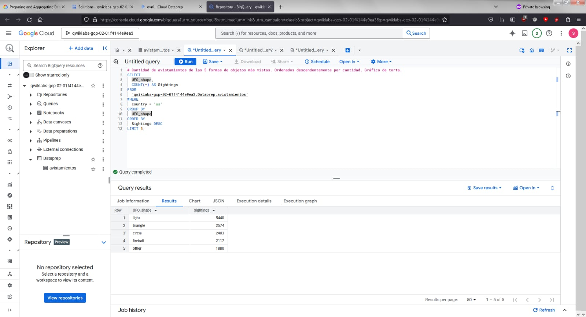

# Evaluación 2 - Big Data

## En esta página se muestran las imágenes de evidencia de la Evaluación 2 de Big Data

### Integrantes:
- Jordy Bazan  
- Benjamin Zuñiga  

**Sección:** 001-D, Grupo 11  
**Fecha:** 29/05/2025  
**Profesor:** Fernando Esteban Fuentes Gallegos

---

## Pasos realizados del laboratorio GSP 823 de Google Cloud

### 1. Creación de bucket
Creamos un bucket y le proporcionamos un nombre para poder identificarlo.  

### 2. Selección de Alteryx Designer Granging
Seleccionamos el apartado de Analytics y luego la opción **Alteryx Designer Granging**.  

### 3. Creación de Flow en Dataprep
Creamos un nuevo flow y le damos un nombre.  
  

### 4. Carga del Dataset
Cargamos el dataset `ufo_sighting.xlsx`.  

### 5. Edición del Dataset
Seleccionamos **Edit recipe** para visualizar y editar los datos.  
  

### 6. Limpieza de Datos
Eliminamos datos nulos e inexistentes.  
  

### 7. Ejecución del Flujo
Hacemos clic en **Run** y seleccionamos **Create-CSV**.  

### 8. Configuración del Output
Seleccionamos **Truncate the table every run**, hacemos clic en **Update** y luego en **Run**.  
  
  

### 9. Visualización en BigQuery
Hacemos clic en **View on BigQuery**.  

### 10. Ejecución de Consultas SQL
Accedemos a la lupa **Query** para ejecutar las consultas.  
  

---

## Visualización en Looker Studio

Luego de ejecutar las consultas SQL, accedemos a **Looker Studio** para visualizar los resultados como gráficos.

### Gráfico de Torta
Cantidad de avistamientos de las 5 formas de objetos más vistas.  

### Gráfico de Barras
Cantidad de avistamientos por año.  

### Mapa Global
Cantidad de avistamientos por estado dentro de Estados Unidos.

> **Nota:** Se cambió el dato "State" de tipo texto a tipo "Geo", seleccionando "Country" para que el mapa se limitara a EE.UU.  

---

## ¡Gracias por su tiempo!
